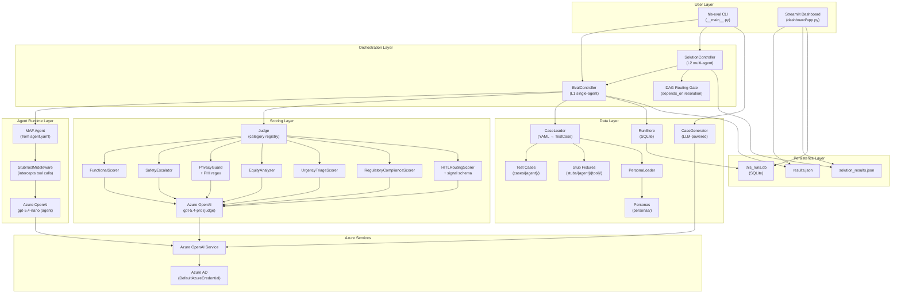

# System Architecture Overview

HLSHarness is a **CLI evaluation harness** for patient scheduling multi-agent systems. It runs agents in a sandboxed environment with stubbed tool responses, scores outputs against category-specific rubrics using a judge LLM, and produces structured pass/fail reports.

## Architecture Layers

## Component Responsibilities

| Component | File(s) | Responsibility |
|-----------|---------|----------------|
| `EvalController` | `hlsharness/controller.py` | Run L1 eval for one agent: load cases → run agent → score → persist |
| `SolutionController` | `hlsharness/solution_controller.py` | Run L2 eval: iterate agents, apply DAG gate, rollup categories |
| `MAF Agent` | `cases/{agent}/agent.yaml` | Declarative agent definition (model, system prompt, tools) |
| `StubToolMiddleware` | `hlsharness/stub_middleware.py` | Intercept MAF tool calls → return fixtures → record trajectory |
| `Judge` | `hlsharness/judge.py` | Category-keyed scoring registry; lazy-initialize scorer instances |
| `BaseScorer` | `hlsharness/base_scorer.py` | 3-stage pipeline: veto → pre-check → LLM rubric |
| `CaseLoader` | `hlsharness/loader.py` | Parse YAML test case files into `TestCase` dataclasses |
| `CaseGenerator` | `hlsharness/generator.py` | LLM-powered generation of new test cases from agent.yaml |
| `PersonaLoader` | `hlsharness/persona_loader.py` | Load demographic persona profiles (equity testing) |
| `RunStore` | `hlsharness/run_store.py` | SQLite persistence of run history and baseline tracking |

## Key Architectural Decisions

### MAF YAML as Single Source of Truth
Each agent is defined in a `cases/{agent}/agent.yaml` file containing `name`, `description`, `system_prompt`, `tools`, and `x-harness` configuration. The harness reads this file to build the MAF agent and to validate that test cases reference only declared tools.

### Middleware Intercept (Zero Agent Code Changes)
`StubToolMiddleware` intercepts all MAF tool calls via `ContextVar`, substituting real tool execution with YAML fixtures. The agent code is unchanged and unaware of the stub layer.

### DAG Routing Gate (ADR 0003)
In L2 solution eval, agents declare `depends_on` in `solution.yaml`. The `SolutionController` excludes sub-agents from the rollup if their orchestrator's `functional` + `hitl_routing` categories fail threshold. This prevents cascading failures from inflating solution pass rates.

### No API Keys
All Azure OpenAI calls use `DefaultAzureCredential` + `get_bearer_token_provider()`. Token refresh is handled automatically. No secrets are stored in code, config, or CI environment variables beyond `AZURE_OPENAI_ENDPOINT`.
