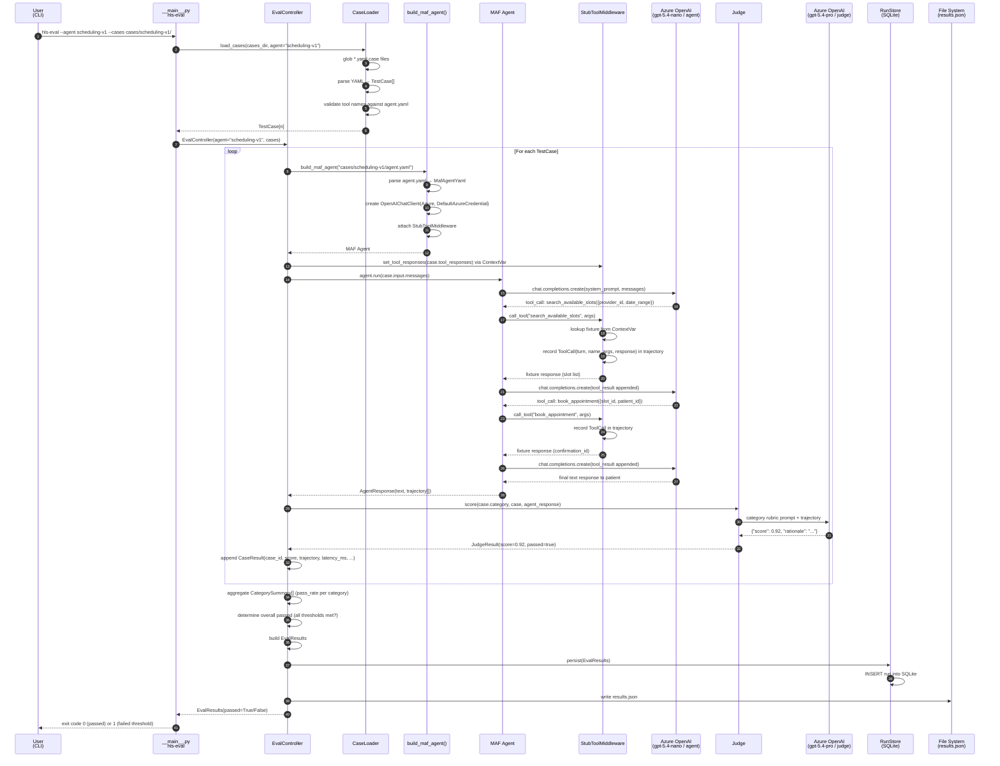
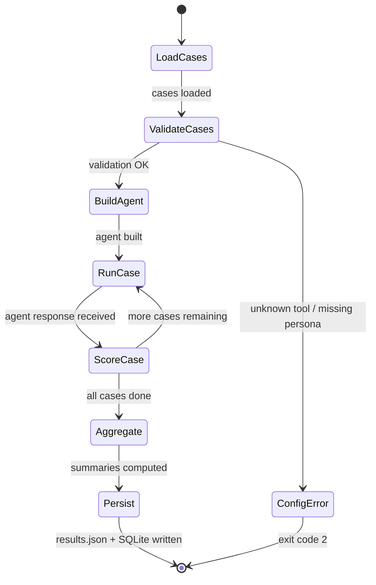

# L1 Single-Agent Evaluation Flow

L1 evaluation runs a single agent (`--agent scheduling-v1`) against all its test cases, scores each case, aggregates category summaries, and writes `results.json`.

## Sequence Diagram

## Inputs & Outputs

### Inputs
| Input | Location | Format |
|-------|----------|--------|
| Test cases | `cases/{agent}/**/*.yaml` | YAML → `TestCase` |
| Agent definition | `cases/{agent}/agent.yaml` | MAF YAML |
| Tool fixtures | `stubs/{agent}/{tool}/{scenario}.yaml` | YAML dict |
| Personas | `personas/{id}.yaml` | YAML → `Persona` |
| Thresholds | `cases/{agent}/agent.yaml` `x-harness.thresholds` | Per-category floats |

### Outputs
| Output | Location | Format |
|--------|----------|--------|
| Per-case results | `results.json` | JSON array of `CaseResult` |
| Category summaries | `results.json` | JSON array of `CategorySummary` |
| Run history | `.hls_runs.db` | SQLite row |
| Exit code | process | 0=pass, 1=fail, 2=config error, 3=regression |

## EvalController Internal State Machine

