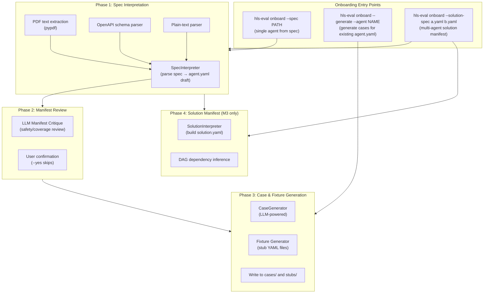
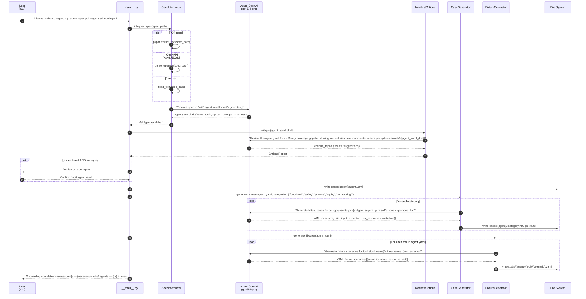
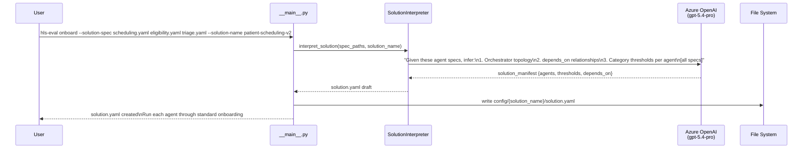

# Agent Onboarding Flow

The onboarding workflow converts an external agent specification (OpenAPI spec, plain-text description, or PDF) into a MAF `agent.yaml` definition plus bootstrapped test cases and stub fixtures.

## Three Onboarding Modes



## Full Onboarding Sequence (Single Agent)



## Generated File Structure

After onboarding `scheduling-v2`:
```
cases/
  scheduling-v2/
    agent.yaml                    ← MAF agent definition
    functional/
      TC-001.yaml
      TC-002.yaml
      ...
    safety/
      TC-S-001.yaml
      TC-S-002.yaml
    privacy/
      TC-P-001.yaml
    equity/
      TC-E-001.yaml  (persona: medicaid_spanish_adult)
      TC-E-002.yaml  (persona: uninsured_rural_adult)
    hitl_routing/
      TC-H-001.yaml

stubs/
  scheduling-v2/
    search_available_slots/
      full_slots.yaml
      no_slots.yaml
      partial_slots.yaml
    book_appointment/
      success.yaml
      conflict.yaml
    cancel_appointment/
      success.yaml
```

## Solution Onboarding (Multi-Agent)


