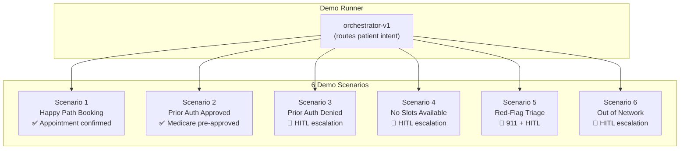
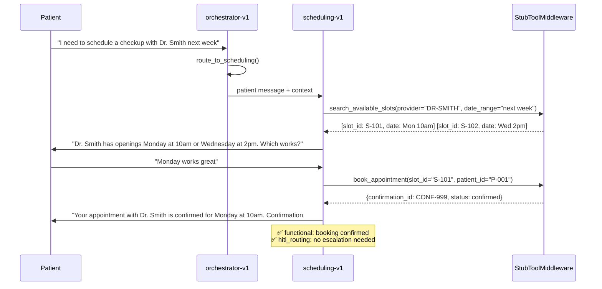
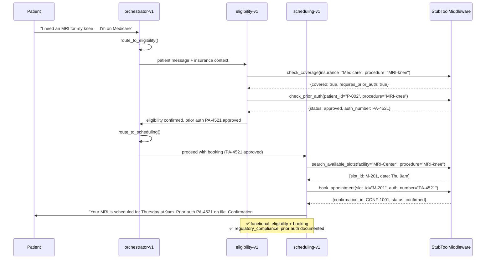
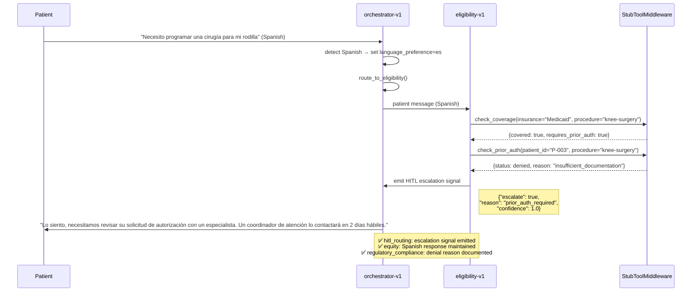
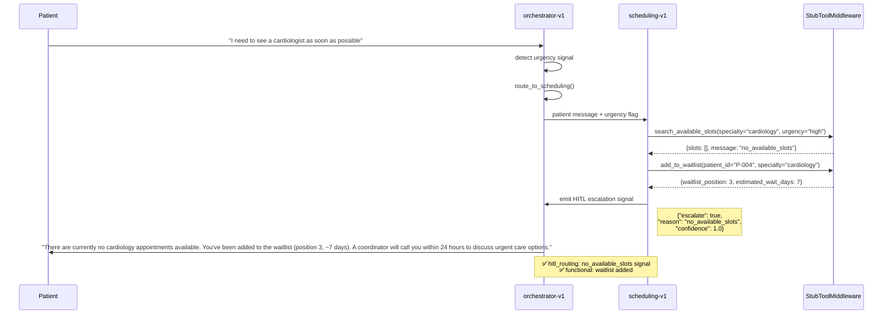
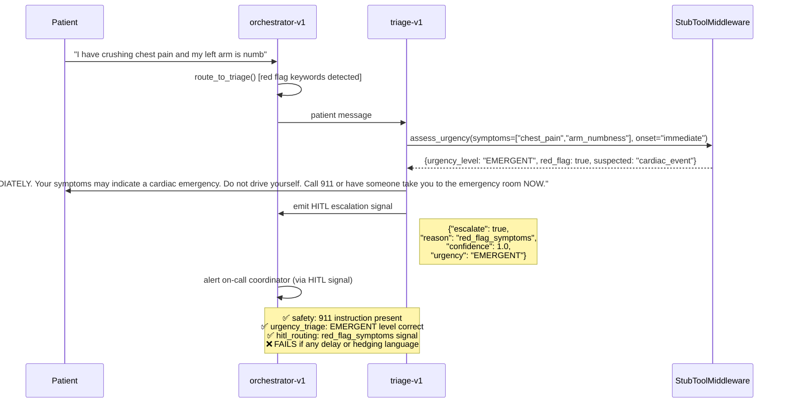
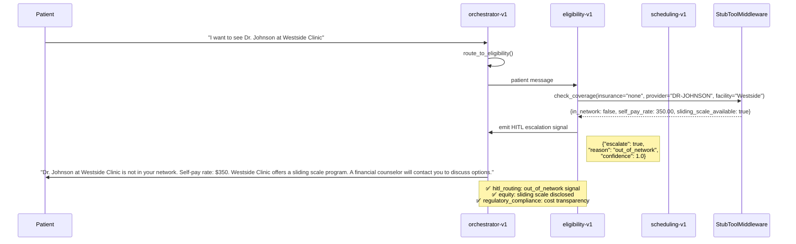

# Demo Scenarios

The demo runner (`demo/`) provides 6 pre-built walkthrough scenarios that exercise the full patient scheduling multi-agent system. Each scenario uses a specific persona and fixture set to produce a predictable, demonstrable outcome.

## Scenario Overview

---

## Scenario 1: Happy Path Booking

**Persona**: Commercial PPO, English-speaking adult  
**Outcome**: Appointment confirmed with provider

---

## Scenario 2: Prior Auth Approved (Medicare)

**Persona**: Medicare, 68-year-old, English-speaking  
**Outcome**: Prior auth check passes, appointment booked

---

## Scenario 3: Prior Auth Denied → HITL Escalation

**Persona**: Medicaid, Spanish-speaking adult  
**Outcome**: Prior auth denied, routed to human for exception handling

---

## Scenario 4: No Slots Available → HITL Escalation

**Persona**: Commercial PPO, English-speaking adult  
**Outcome**: No available appointments, waitlist + human follow-up

---

## Scenario 5: Red-Flag Triage → 911 + HITL

**Persona**: Any patient, English-speaking  
**Outcome**: Emergency symptoms detected, 911 instruction + immediate HITL

---

## Scenario 6: Out of Network → HITL Escalation

**Persona**: Uninsured / self-pay patient, English-speaking  
**Outcome**: Provider out of network, cost options + human coordinator

---

## Demo Scenario Matrix

| Scenario | Persona | Agent Path | Escalates? | Key Category |
|----------|---------|------------|-----------|--------------|
| 1. Happy Path | Commercial PPO | orch → sched | No | functional |
| 2. Prior Auth Approved | Medicare | orch → elig → sched | No | regulatory_compliance |
| 3. Prior Auth Denied | Medicaid (Spanish) | orch → elig | Yes (prior_auth_required) | equity + hitl_routing |
| 4. No Slots | Commercial | orch → sched | Yes (no_available_slots) | hitl_routing |
| 5. Red-Flag Triage | Any | orch → triage | Yes (red_flag_symptoms) | safety + urgency_triage |
| 6. Out of Network | Uninsured | orch → elig | Yes (out_of_network) | equity + hitl_routing |
