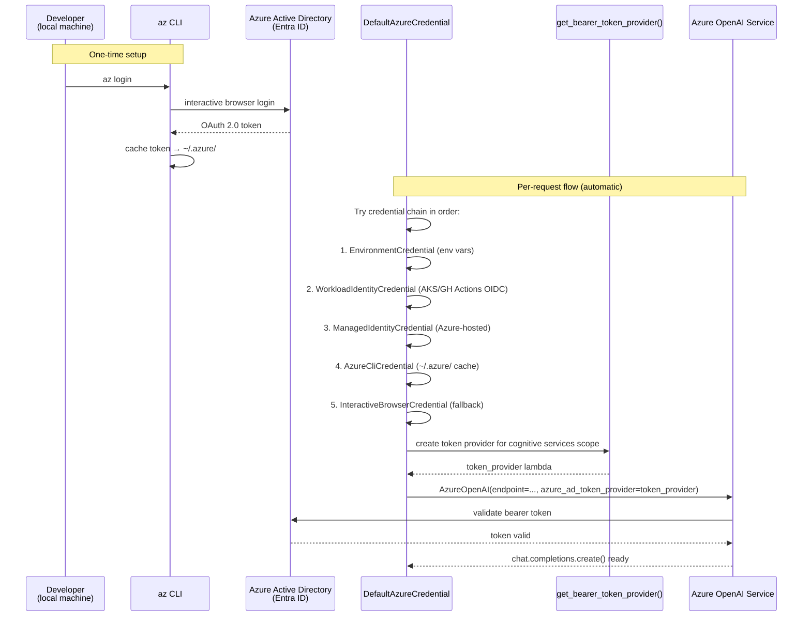
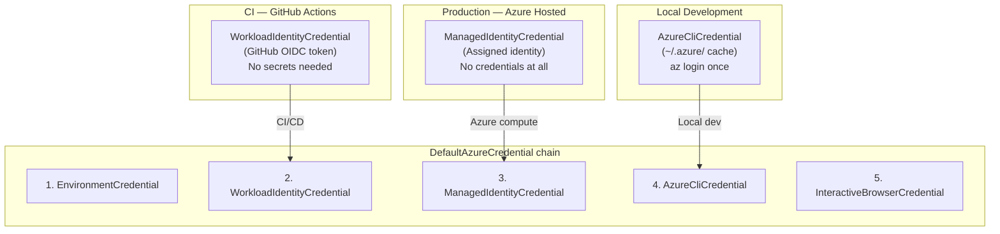
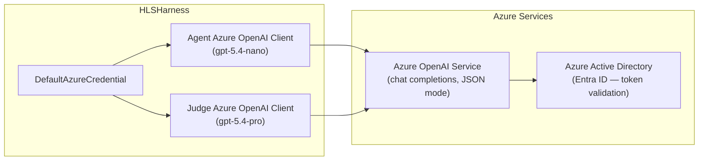

# Authentication & Azure Integration

HLSHarness uses `DefaultAzureCredential` for all Azure OpenAI calls. No API keys are stored anywhere in code, configuration files, or CI environment variables.

## Authentication Flow



## Credential Chain by Environment



## Environment Variables

| Variable | Required | Default | Purpose |
|----------|----------|---------|---------|
| `AZURE_OPENAI_ENDPOINT` | **Yes** | — | Full Azure OpenAI endpoint URL |
| `AZURE_OPENAI_DEPLOYMENT_JUDGE` | No | `gpt-5.4-pro` | Judge model deployment name |
| `AZURE_OPENAI_DEPLOYMENT_SCHEDULING` | No | `gpt-5.4-nano` | scheduling-v1 agent model |
| `AZURE_OPENAI_DEPLOYMENT_<AGENT>` | No | — | Per-agent model overrides |

**No API keys, no connection strings, no passwords** — only the endpoint URL (not a secret) is required.

## Azure Services Used



**Notable**: HLSHarness does **not** use Azure Storage, Key Vault, Service Bus, or any other Azure service beyond Azure OpenAI. All persistence is local (SQLite, JSON files).

## Token Refresh

`get_bearer_token_provider()` from `azure-identity` wraps the credential in a lazy refresh provider. Tokens are automatically refreshed before expiry — no explicit token management in application code.

```python
# Pattern used in hlsharness/maf_agent.py
from azure.identity import DefaultAzureCredential, get_bearer_token_provider

credential = DefaultAzureCredential()
token_provider = get_bearer_token_provider(
    credential, "https://cognitiveservices.azure.com/.default"
)

client = AzureOpenAI(
    azure_endpoint=os.environ["AZURE_OPENAI_ENDPOINT"],
    azure_ad_token_provider=token_provider,
    api_version="2024-12-01-preview",
)
```
